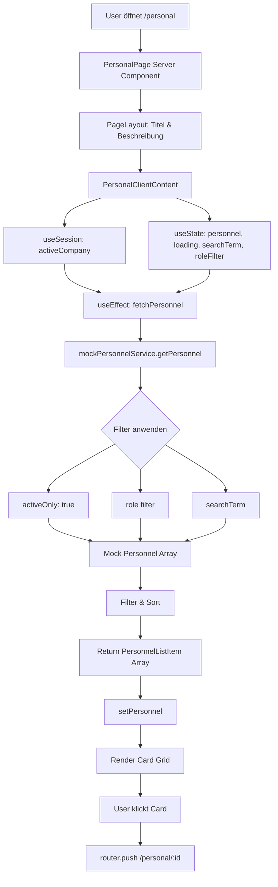

# Phase 5: Personnel Module - Personalverwaltung

**Status:** ✅ Basis-Implementation Fertig  
**Version:** 1.0.0  
**Letzte Aktualisierung:** 2025-01-XX

---

## Übersicht

Das **Personnel Module** (Personalverwaltung) ist das fünfte implementierte Modul von AgroTrack. Es ermöglicht die vollständige Verwaltung aller betrieblichen Mitarbeiter, einschließlich:

- **Stammdaten**: Namen, Kontaktdaten, Beschäftigungsstatus, Verträge
- **Qualifikationen**: Pflanzenschutz-Sachkunde, Führerscheine, Zertifikate mit Ablaufdaten
- **Notfallkontakte**: Wichtige Kontaktpersonen für Notfälle
- **Dokumente**: Arbeitsverträge, Zeugnisse, Lizenzen
- **Arbeitszeiterfassung**: Grundlagen für spätere Zeiterfassung

Das Modul ist eng verzahnt mit dem [Operations Module](PHASE4_OPERATIONS.md), da jede Operation Mitarbeiter zugewiesen werden können (PersonnelAssignment).

### Konzept-Referenz

Dieses Modul implementiert die Anforderungen aus:
- `AckerPlanPro_Konzept.md`: Abschnitt "Personalverwaltung"
- Rechtliche Anforderungen: Pflanzenschutz-Sachkundenachweis (§9 PflSchG)

---

## Implementierte Komponenten

### 1. Type System (`src/services/personnel-types.ts`)

Vollständiges TypeScript-Typsystem mit 600+ Zeilen Code.

#### A. Enums

**PersonnelRole** - Rollen/Positionen im Betrieb:
```typescript
enum PersonnelRole {
  FARM_MANAGER    = 'FARM_MANAGER',      // Betriebsleiter
  FARMER          = 'FARMER',             // Landwirt/Fachkraft
  TRACTOR_DRIVER  = 'TRACTOR_DRIVER',    // Traktorfahrer
  HARVEST_HELPER  = 'HARVEST_HELPER',    // Erntehelfer (saisonal)
  MECHANIC        = 'MECHANIC',          // Mechaniker
  ANIMAL_CARETAKER = 'ANIMAL_CARETAKER', // Tierpfleger
  ADMIN           = 'ADMIN',              // Verwaltung/Büro
  APPRENTICE      = 'APPRENTICE',         // Auszubildender
  INTERN          = 'INTERN',             // Praktikant
  OTHER           = 'OTHER'               // Sonstiges
}
```

**EmploymentStatus** - Beschäftigungsart:
```typescript
enum EmploymentStatus {
  FULL_TIME   = 'FULL_TIME',   // Vollzeit
  PART_TIME   = 'PART_TIME',   // Teilzeit
  SEASONAL    = 'SEASONAL',    // Saisonarbeiter
  MINI_JOB    = 'MINI_JOB',    // Minijob (450€/520€)
  TRAINEE     = 'TRAINEE',     // Praktikant/Auszubildender
  CONTRACTOR  = 'CONTRACTOR',  // Freiberufler
  INACTIVE    = 'INACTIVE'     // Inaktiv (ehemalige Mitarbeiter)
}
```

**QualificationType** - Qualifikationsarten:
```typescript
enum QualificationType {
  PESTICIDE_LICENSE    = 'PESTICIDE_LICENSE',      // Pflanzenschutz-Sachkunde ⚠️
  DRIVER_LICENSE_T     = 'DRIVER_LICENSE_T',       // Führerschein Klasse T
  DRIVER_LICENSE_C     = 'DRIVER_LICENSE_C',       // LKW-Führerschein
  FORKLIFT_LICENSE     = 'FORKLIFT_LICENSE',       // Gabelstapler
  WELDING_CERTIFICATE  = 'WELDING_CERTIFICATE',    // Schweißerschein
  FIRST_AID            = 'FIRST_AID',              // Erste Hilfe
  CARGO_SECURING       = 'CARGO_SECURING',         // Ladungssicherung
  ANIMAL_WELFARE       = 'ANIMAL_WELFARE',         // Tierschutz-Schulung
  HYGIENE_HACCP        = 'HYGIENE_HACCP',          // HACCP
  WORK_SAFETY          = 'WORK_SAFETY',            // Arbeitssicherheit
  OTHER                = 'OTHER'
}
```

#### B. Kerninterfaces

**Personnel** - Vollständiges Mitarbeiter-Modell:
```typescript
interface Personnel {
  // === Identität ===
  id: string;
  tenantId: string;
  companyId: string;
  
  // === Persönliche Daten ===
  firstName: string;
  lastName: string;
  fullName?: string;
  dateOfBirth?: Date;
  nationality?: string;
  employeeNumber?: string;  // z.B. "LW-001"
  photoUrl?: string;
  
  // === Position & Status ===
  role: PersonnelRole;
  employmentStatus: EmploymentStatus;
  department?: string;
  
  // === Kontakt ===
  contactInfo: ContactInfo;
  emergencyContact?: EmergencyContact;
  
  // === Vertrag ===
  contract: EmploymentContract;
  
  // === Qualifikationen ===
  qualifications: Qualification[];
  hasPesticideLicense?: boolean;   // Computed: any valid PESTICIDE_LICENSE
  hasTractorLicense?: boolean;     // Computed: valid DRIVER_LICENSE_T
  
  // === Fähigkeiten ===
  skills: string[];
  languages: string[];
  skillNotes?: string;
  
  // === Dokumente ===
  documents: PersonnelDocument[];
  
  // === Notizen & Sonstiges ===
  notes?: string;
  preferredTasks?: string[];
  healthRestrictions?: string;  // vertraulich!
  
  // === Audit Trail ===
  createdAt: Date;
  updatedAt: Date;
  createdBy?: string;
  updatedBy?: string;
}
```

**Qualification** - Zertifikat/Lizenz:
```typescript
interface Qualification {
  type: QualificationType;
  name: string;
  issuedDate: Date;
  expiryDate?: Date;       // Falls befristet
  isValid: boolean;        // Computed: expiryDate >= today
  certificateNumber?: string;
  issuingAuthority?: string;
  documentUrl?: string;
  notes?: string;
}
```

**EmploymentContract** - Vertragsdetails:
```typescript
interface EmploymentContract {
  startDate: Date;
  endDate?: Date;          // Falls befristet
  isPermanent: boolean;
  weeklyHours: number;     // z.B. 40
  hourlyRate?: number;     // € pro Stunde (Stundenlohn)
  monthlySalary?: number;  // € pro Monat (Gehalt)
  vacationDays: number;    // Urlaubstage/Jahr
  probationPeriod?: number;   // Probezeit in Monaten
  noticePeriod?: number;      // Kündigungsfrist in Tagen
}
```

**ContactInfo** & **EmergencyContact**:
```typescript
interface ContactInfo {
  email?: string;
  phone?: string;
  mobile?: string;
  street?: string;
  postalCode?: string;
  city?: string;
  country?: string;
}

interface EmergencyContact {
  name: string;              // z.B. "Maria Müller"
  relationship: string;      // z.B. "Ehefrau"
  phone: string;
  alternativePhone?: string;
}
```

#### C. Hilfsdatentypen

**PersonnelListItem** - Vereinfachte Ansicht für Listen:
```typescript
interface PersonnelListItem {
  id: string;
  fullName: string;
  firstName: string;
  lastName: string;
  role: PersonnelRole;
  employmentStatus: EmploymentStatus;
  photoUrl?: string;
  email?: string;
  phone?: string;
  hasPesticideLicense: boolean;
  hasTractorLicense: boolean;
  expiringQualificationsCount?: number;  // Qualifikationen, die bald ablaufen
  updatedAt: Date;
}
```

**PersonnelFilters** - Filter für Abfragen:
```typescript
interface PersonnelFilters {
  role?: PersonnelRole;
  employmentStatus?: EmploymentStatus;
  qualification?: QualificationType;
  hasPesticideLicense?: boolean;
  hasTractorLicense?: boolean;
  searchTerm?: string;
  sortBy?: 'name' | 'role' | 'hireDate' | 'employeeNumber';
  activeOnly?: boolean;  // Standard: true
}
```

**PersonnelStatistics** - Dashboard-Statistiken:
```typescript
interface PersonnelStatistics {
  totalCount: number;
  activeCount: number;
  fullTimeCount: number;
  partTimeCount: number;
  seasonalCount: number;
  roleDistribution: Record<PersonnelRole, number>;
  expiringQualifications: Array<{
    personnelId: string;
    personnelName: string;
    qualificationType: QualificationType;
    expiryDate: Date;
  }>;
  averageTenureYears: number;
  pesticideLicenseCount: number;
  tractorLicenseCount: number;
}
```

---

### 2. Mock Service (`src/services/mock-personnel-service.ts`)

Development-Service mit realistischen Beispieldaten.

#### A. Mock-Datenbank

**6 Beispiel-Mitarbeiter** mit vollständigen Daten:

1. **Thomas Müller (PERS-001)**
   - Rolle: Betriebsleiter (FARM_MANAGER)
   - Status: Vollzeit, seit 2005
   - Qualifikationen: 
     * Pflanzenschutz-Sachkunde (gültig bis 2027)
     * Führerschein T & CE
     * Erste Hilfe (gültig bis 2026)
     * Arbeitssicherheit
   - Notizen: Meisterbrief Landwirtschaft, 20+ Jahre Erfahrung

2. **Stefan Weber (PERS-002)**
   - Rolle: Traktorfahrer
   - Status: Vollzeit, seit 2012
   - Qualifikationen:
     * Führerschein T & C
     * Gabelstapler
     * Erste Hilfe (gültig bis 2025)
     * Ladungssicherung
   - Spezialisierung: Bodenbearbeitung, Aussaat
   - **ACHTUNG**: Keine Pflanzenschutz-Lizenz! Darf nicht spritzen!

3. **Anna Schmidt (PERS-003)**
   - Rolle: Landwirtin (FARMER)
   - Status: Vollzeit, seit 2018
   - Qualifikationen:
     * ⚠️ Pflanzenschutz-Sachkunde **ABGELAUFEN** seit Jun 2024!
     * Führerschein T
     * Erste Hilfe (gültig bis 2026)
     * Tierschutz-Sachkunde
   - Gesundheit: Leichte Pollenallergie (Gräser)
   - **KRITISCH**: Fortbildung erforderlich bevor PSM-Arbeiten möglich!

4. **Markus Bauer (PERS-004)**
   - Rolle: Mechaniker
   - Status: Teilzeit (20h/Woche), seit 2015
   - Qualifikationen:
     * Schweißerschein MAG/MIG
     * Landmaschinenmechaniker-Meister
     * Arbeitssicherheit (gültig bis 2026)
     * Erste Hilfe (gültig bis 2025)
   - Besonderheit: Hat eigene Werkstatt, arbeitet teilzeit für Betrieb

5. **Ionuț Popescu (PERS-005)**
   - Rolle: Erntehelfer (HARVEST_HELPER)
   - Status: Saisonal (Mai-Okt 2025)
   - Nationalität: Rumänien
   - Qualifikationen: Erste Hilfe (gültig bis 2026)
   - Sprachen: Rumänisch, Deutsch (Grundkenntnisse), Englisch
   - Dokumente: Saisonvertrag, A1-Bescheinigung (EU-Sozialversicherung)
   - Notizen: Dritte Saison, zuverlässig

6. **Lisa Friedrich (PERS-006)**
   - Rolle: Auszubildende (APPRENTICE)
   - Status: Ausbildung (Aug 2023 - Jul 2026)
   - Qualifikationen:
     * Erste Hilfe (gültig bis 2025)
     * Führerschein T (seit März 2024)
   - Ausbildungsjahr: 2. Lehrjahr
   - Vergütung: €920/Monat
   - Notizen: Sehr motiviert, besucht Berufsschule (Blockunterricht)

#### B. Service-Methoden

**MockPersonnelService** Klasse mit 8 Methoden:

```typescript
class MockPersonnelService {
  // 1. Liste abrufen mit Filtern
  async getPersonnel(
    tenantId: string,
    companyId: string,
    filters?: PersonnelFilters
  ): Promise<PersonnelListItem[]>
  
  // 2. Einzelnen Mitarbeiter abrufen
  async getPersonnelMember(
    tenantId: string,
    personnelId: string
  ): Promise<Personnel | null>
  
  // 3. Neuen Mitarbeiter anlegen
  async createPersonnel(
    tenantId: string,
    companyId: string,
    data: PersonnelFormData,
    userId?: string
  ): Promise<Personnel>
  
  // 4. Mitarbeiter aktualisieren
  async updatePersonnel(
    tenantId: string,
    personnelId: string,
    data: Partial<PersonnelFormData>
  ): Promise<Personnel | null>
  
  // 5. Mitarbeiter löschen (setzt auf INACTIVE)
  async deletePersonnel(
    tenantId: string,
    personnelId: string
  ): Promise<boolean>
  
  // 6. Qualifikation hinzufügen/aktualisieren
  async updateQualification(
    tenantId: string,
    personnelId: string,
    qualification: Qualification
  ): Promise<Personnel | null>
  
  // 7. Statistiken abrufen
  async getPersonnelStatistics(
    tenantId: string,
    companyId: string
  ): Promise<PersonnelStatistics>
}

// Singleton-Instanz
export const mockPersonnelService = new MockPersonnelService();
```

**Besonderheiten der getPersonnel-Methode:**

- **activeOnly**: Standard `true`, filtert INACTIVE-Mitarbeiter aus
- **Suchtext**: Sucht in `fullName`, `firstName`, `lastName`, `employeeNumber`, `email`
- **Sortierung**: Nach Name (Standard), Rolle, Einstellungsdatum, Personalnummer
- **Qualifikationsfilter**: Nur Mitarbeiter mit gültiger Qualifikation
- **Computed Fields**: `hasPesticideLicense` und `hasTractorLicense` werden automatisch berechnet

---

### 3. UI Component (`src/components/personal/personal-client-content.tsx`)

**Client-Side React Component** für die Mitarbeiterliste.

#### Funktionen

- ✅ **Suche**: 300ms Debounce, sucht in Name und E-Mail
- ✅ **Filter nach Rolle**: Alle, Betriebsleiter, Fahrer, Landwirt, Mechaniker
- ✅ **Responsive Card-Grid**: 1 Spalte (Mobile), 2 Spalten (Tablet), 3 Spalten (Desktop)
- ✅ **Status-Badges**: Farbcodierung nach Beschäftigungsstatus
- ✅ **Qualifikations-Anzeige**: Pflanzenschutz-Lizenz (PSM), Traktor-Führerschein (Klasse T)
- ✅ **Ablaufwarnungen**: Hinweis auf bald ablaufende Qualifikationen (nächste 60 Tage)
- ✅ **Skeleton Loader**: 6 Platzhalter-Cards während Datenabfrage
- ✅ **Empty State**: Wenn keine Mitarbeiter gefunden oder vorhanden
- ✅ **Click Handler**: Navigiert zu `/personal/{personnelId}` (Detail-View, noch nicht implementiert)

#### Status-Farben

```typescript
const STATUS_VARIANTS: Record<EmploymentStatus, BadgeVariant> = {
  FULL_TIME: 'success',      // Grün
  PART_TIME: 'info',         // Blau
  SEASONAL: 'warning',       // Orange
  MINI_JOB: 'neutral',       // Grau
  TRAINEE: 'info',           // Blau
  CONTRACTOR: 'neutral',     // Grau
  INACTIVE: 'destructive',   // Rot
};
```

#### Card-Inhalt

Jede Mitarbeiter-Card zeigt:

1. **Header**:
   - Vollständiger Name (CardTitle)
   - Rolle/Position (klein, grau)
   - Status-Badge (farbcodiert)

2. **Content**:
   - E-Mail-Adresse (falls vorhanden)
   - Telefonnummer (falls vorhanden)
   - Qualifikations-Icons:
     * ✅ PSM-Lizenz (grün)
     * ✅ Klasse T (blau)
   - ⚠️ Ablaufwarnung (falls Qualifikationen in 60 Tagen ablaufen)
   - Letzte Aktualisierung (Datum)

#### Code-Beispiel

```tsx
<Card
  className="cursor-pointer hover:border-primary transition-colors"
  onClick={() => router.push(`./personal/${person.id}`)}
>
  <CardHeader>
    <CardTitle className="text-lg">{person.fullName}</CardTitle>
    <p className="text-xs text-muted-foreground">
      {ROLE_LABELS[person.role]}
    </p>
    <StatusBadge variant={STATUS_VARIANTS[person.employmentStatus]}>
      {STATUS_LABELS[person.employmentStatus]}
    </StatusBadge>
  </CardHeader>
  <CardContent>
    {person.email && <div>E-Mail: {person.email}</div>}
    {person.phone && <div>Tel: {person.phone}</div>}
    
    {/* Qualifikationen */}
    {person.hasPesticideLicense && (
      <CheckCircle className="h-3 w-3 text-green-600" />
      <span>PSM-Lizenz</span>
    )}
    {person.hasTractorLicense && (
      <CheckCircle className="h-3 w-3 text-blue-600" />
      <span>Klasse T</span>
    )}
    
    {/* Ablaufwarnung */}
    {person.expiringQualificationsCount > 0 && (
      <AlertCircle className="h-3 w-3" />
      <span>{person.expiringQualificationsCount} Qualifikation(en) laufen bald ab</span>
    )}
  </CardContent>
</Card>
```

---

### 4. Page Integration (`src/app/[locale]/personal/page.tsx`)

Server Component mit **PageLayout** Wrapper.

```tsx
import { PageLayout } from '@/components/layout/page-layout';
import { PersonalClientContent } from '@/components/personal/personal-client-content';
import { getTranslations, setRequestLocale } from 'next-intl/server';

export default async function PersonalPage({
  params: { locale }
}: {
  params: { locale: string }
}) {
  setRequestLocale(locale);
  const t = await getTranslations({ locale, namespace: 'PersonalPage' });
  
  return (
    <PageLayout title={t('title')} description={t('description')}>
      <PersonalClientContent />
    </PageLayout>
  );
}
```

**Benötigte Übersetzungen** (`src/messages/de.json`):
```json
{
  "PersonalPage": {
    "title": "Personal",
    "description": "Verwalten Sie Mitarbeiter, Qualifikationen und Verträge"
  }
}
```

---

## Datenfluss



---

## Verwendung

### Mitarbeiter abrufen

**Alle aktiven Mitarbeiter:**
```typescript
const personnel = await mockPersonnelService.getPersonnel(
  'tenant-1',
  'company-1'
);
// Gibt alle aktiven Mitarbeiter zurück (activeOnly: true default)
```

**Mit Filtern:**
```typescript
const filters: PersonnelFilters = {
  role: PersonnelRole.TRACTOR_DRIVER,
  hasPesticideLicense: true,
  searchTerm: 'müller',
  sortBy: 'name',
  activeOnly: true
};

const personnel = await mockPersonnelService.getPersonnel(
  'tenant-1',
  'company-1',
  filters
);
// Gibt nur Traktorfahrer mit PSM-Lizenz zurück, deren Name "müller" enthält
```

### Einzelnen Mitarbeiter abrufen

```typescript
const person = await mockPersonnelService.getPersonnelMember(
  'tenant-1',
  'PERS-001'
);

if (person) {
  console.log(person.fullName);  // "Thomas Müller"
  console.log(person.role);       // PersonnelRole.FARM_MANAGER
  console.log(person.hasPesticideLicense);  // true
  
  // Qualifikationen prüfen
  const pesticideLicense = person.qualifications.find(
    q => q.type === QualificationType.PESTICIDE_LICENSE
  );
  
  if (pesticideLicense && !pesticideLicense.isValid) {
    console.warn('Pflanzenschutz-Lizenz abgelaufen!');
  }
}
```

### Neuen Mitarbeiter erstellen

```typescript
const formData: PersonnelFormData = {
  firstName: 'Max',
  lastName: 'Mustermann',
  dateOfBirth: new Date('1990-05-15'),
  employeeNumber: 'LW-007',
  role: PersonnelRole.FARMER,
  employmentStatus: EmploymentStatus.FULL_TIME,
  
  // Kontakt
  email: 'max.mustermann@farm.de',
  phone: '+49 123 456789',
  mobile: '+49 170 1234567',
  street: 'Feldweg 10',
  postalCode: '12345',
  city: 'Musterstadt',
  
  // Vertrag
  contractStartDate: new Date('2025-03-01'),
  isPermanent: true,
  weeklyHours: 40,
  hourlyRate: 18.00,
  vacationDays: 28,
  
  // Notfallkontakt
  emergencyContactName: 'Anna Mustermann',
  emergencyContactRelationship: 'Ehefrau',
  emergencyContactPhone: '+49 170 9876543',
  
  // Fähigkeiten
  skills: ['Traktorfahren', 'Pflanzenbau'],
  languages: ['Deutsch', 'Englisch'],
  
  notes: 'Neuer Mitarbeiter ab März 2025'
};

const newPerson = await mockPersonnelService.createPersonnel(
  'tenant-1',
  'company-1',
  formData,
  'user-123'  // userId für Audit Trail
);

console.log(newPerson.id);  // "PERS-007"
```

### Mitarbeiter aktualisieren

```typescript
const updates: Partial<PersonnelFormData> = {
  mobile: '+49 170 9999999',
  employmentStatus: EmploymentStatus.PART_TIME,
  weeklyHours: 30,
  notes: 'Reduzierung auf Teilzeit ab 01.04.2025'
};

const updated = await mockPersonnelService.updatePersonnel(
  'tenant-1',
  'PERS-002',
  updates
);
```

### Qualifikation hinzufügen

```typescript
const newQualification: Qualification = {
  type: QualificationType.PESTICIDE_LICENSE,
  name: 'Pflanzenschutz-Sachkundenachweis',
  issuedDate: new Date('2025-01-15'),
  expiryDate: new Date('2028-01-15'),
  isValid: true,
  certificateNumber: 'PSK-2025-HD-0999',
  issuingAuthority: 'Landwirtschaftskammer Baden-Württemberg',
  notes: 'Neu erworben nach Fortbildung'
};

const updated = await mockPersonnelService.updateQualification(
  'tenant-1',
  'PERS-002',  // Stefan Weber bekommt PSM-Lizenz
  newQualification
);

console.log(updated?.hasPesticideLicense);  // true
```

### Mitarbeiter deaktivieren

```typescript
// Setzt employmentStatus auf INACTIVE (soft delete)
const success = await mockPersonnelService.deletePersonnel(
  'tenant-1',
  'PERS-005'
);

// Mitarbeiter ist nun inaktiv und wird bei activeOnly: true nicht mehr angezeigt
```

### Statistiken abrufen

```typescript
const stats = await mockPersonnelService.getPersonnelStatistics(
  'tenant-1',
  'company-1'
);

console.log(stats.activeCount);            // z.B. 6
console.log(stats.fullTimeCount);          // z.B. 4
console.log(stats.pesticideLicenseCount);  // z.B. 1
console.log(stats.averageTenureYears);     // z.B. 8.5

// Ablaufende Qualifikationen
stats.expiringQualifications.forEach(exp => {
  console.warn(
    `${exp.personnelName}: ${exp.qualificationType} läuft ab am ${exp.expiryDate}`
  );
});
// Output: "Anna Schmidt: PESTICIDE_LICENSE läuft ab am 2024-06-20" (bereits abgelaufen!)
```

---

## Component Integration

### Integration mit Operations Module

Das Personnel Module ist eng verzahnt mit dem [Operations Module](PHASE4_OPERATIONS.md):

**PersonnelAssignment in Operations:**
```typescript
// In operation-types.ts
interface PersonnelAssignment {
  personnelId: string;    // ← Referenz auf Personnel.id
  personnelName: string;  // Für schnelle Anzeige
  role: string;           // Aufgabe bei dieser Operation
  hoursWorked?: number;
  hourlyRate?: number;
}

interface Operation {
  id: string;
  // ...
  personnel: PersonnelAssignment[];  // Zugewiesene Mitarbeiter
  // ...
}
```

**Beispiel: Operation mit Personal-Zuweisung:**
```typescript
const operation: Operation = {
  id: 'OP-001',
  title: 'Weizen-Aussaat Nordfeld',
  operationType: OperationType.SOWING,
  fieldId: 'FIELD-001',
  
  personnel: [
    {
      personnelId: 'PERS-001',    // Thomas Müller
      personnelName: 'Thomas Müller',
      role: 'Betriebsleitung',
      hoursWorked: 2,
      hourlyRate: 35.00
    },
    {
      personnelId: 'PERS-002',    // Stefan Weber
      personnelName: 'Stefan Weber',
      role: 'Traktorfahrer',
      hoursWorked: 8,
      hourlyRate: 18.50
    }
  ],
  
  costs: {
    laborCosts: 2 * 35.00 + 8 * 18.50  // = €218.00
  }
};
```

**zukünftige Integration:**
- Validation: Prüfe ob `personnelId` existiert
- Qualification Check: Prüfe ob Personal für Task qualifiziert
  * Bei SPRAYING: Pflanzenschutz-Lizenz erforderlich!
  * Bei Traktorarbeiten: Führerschein Klasse T erforderlich
- Work Time Tracking: PersonnelAssignment → WorkTimeEntry

---

### Dashboard-Integration (zukünftig)

**Geplante Dashboard-Widgets:**

1. **Personnel Overview Card**:
   - Anzahl aktive Mitarbeiter
   - Verteilung Vollzeit/Teilzeit/Saisonal
   - Durchschnittliche Betriebszugehörigkeit

2. **Expiring Qualifications Alert**:
   - Liste aller Qualifikationen, die in 30 Tagen ablaufen
   - Kritisch: Pflanzenschutz-Lizenzen (rechtlich erforderlich!)
   - Erste-Hilfe-Kurse
   - Führerscheine (falls befristet)

3. **Work Time Summary**:
   - Gesamte Arbeitsstunden pro Monat
   - Überstunden
   - Urlaubstage

```typescript
// Dashboard Component (Beispiel)
function PersonnelDashboardWidget() {
  const [stats, setStats] = useState<PersonnelStatistics>();
  
  useEffect(() => {
    mockPersonnelService.getPersonnelStatistics('tenant-1', 'company-1')
      .then(setStats);
  }, []);
  
  return (
    <Card>
      <CardHeader>
        <CardTitle>Personal</CardTitle>
      </CardHeader>
      <CardContent>
        <div className="grid gap-4">
          <div>
            <p className="text-3xl font-bold">{stats?.activeCount}</p>
            <p className="text-sm text-muted-foreground">Aktive Mitarbeiter</p>
          </div>
          
          {stats?.expiringQualifications.length > 0 && (
            <Alert variant="warning">
              <AlertCircle className="h-4 w-4" />
              <AlertTitle>Lizenzen laufen ab!</AlertTitle>
              <AlertDescription>
                {stats.expiringQualifications.length} Qualifikation(en) müssen erneuert werden
              </AlertDescription>
            </Alert>
          )}
        </div>
      </CardContent>
    </Card>
  );
}
```

---

## Konfiguration & Anpassung

### Neue Rollen hinzufügen

**1. Enum erweitern:**
```typescript
// personnel-types.ts
enum PersonnelRole {
  // ... existing roles
  FIELD_SCOUT = 'FIELD_SCOUT',  // Feldscout für Monitoring
}
```

**2. Label hinzufügen:**
```typescript
// personal-client-content.tsx
const ROLE_LABELS: Record<PersonnelRole, string> = {
  // ... existing labels
  [PersonnelRole.FIELD_SCOUT]: 'Feldscout',
};
```

**3. Filteroption hinzufügen (optional):**
```typescript
// personal-client-content.tsx
const filterOptions = [
  { label: 'Alle', value: 'ALL' },
  // ... existing options
  { label: 'Feldscout', value: PersonnelRole.FIELD_SCOUT },
];
```

### Neue Qualifikationstypen

**1. QualificationType Enum erweitern:**
```typescript
enum QualificationType {
  // ... existing types
  DRONE_LICENSE = 'DRONE_LICENSE',  // Drohnenführerschein
  ORGANIC_FARMING = 'ORGANIC_FARMING',  // Bio-Landwirtschaft Zertifikat
}
```

**2. Validation Logic hinzufügen:**
```typescript
function isQualifiedForTask(
  personnel: Personnel,
  taskType: OperationType
): boolean {
  switch (taskType) {
    case OperationType.SPRAYING:
      return personnel.hasPesticideLicense;  // Pflicht!
    
    case OperationType.DRONE_OPERATION:
      return personnel.qualifications.some(
        q => q.type === QualificationType.DRONE_LICENSE && q.isValid
      );
    
    default:
      return true;  // Keine spezielle Qualifikation erforderlich
  }
}
```

### Status-Farben anpassen

```typescript
// personal-client-content.tsx
const STATUS_VARIANTS: Record<EmploymentStatus, BadgeVariant> = {
  [EmploymentStatus.FULL_TIME]: 'success',     // Ändern: 'info'
  [EmploymentStatus.SEASONAL]: 'warning',      // Ändern: 'neutral'
  // ...
};
```

---

## Bekannte Einschränkungen & TODOs

### Aktuell NICHT implementiert

❌ **Detail-View**: Klick auf Mitarbeiter-Card führt zu 404  
   → Muss noch erstellt werden: `/personal/[id]/page.tsx`

❌ **Create/Edit Forms**: Keine Formulare zum Hinzufügen/Bearbeiten  
   → Siehe old implementation für Referenz (Sheets mit Forms)

❌ **Qualifikations-Management**: Keine UI zum Hinzufügen von Zertifikaten  
   → Service-Methode vorhanden, aber kein UI

❌ **Dokument-Upload**: Keine Datei-Uploads  
   → `PersonnelDocument.fileUrl` ist nur Platzhalter

❌ **Arbeitszeiterfassung**: WorkTimeEntry definiert, aber nicht verwendet  
   → Zukünftig: Zeiterfassung über separate Modul

❌ **Foto-Upload**: `photoUrl` ist optional, aber kein Upload-UI  
   → Könnte über Avatar-Component mit Upload-Button realisiert werden

❌ **Vertragsverwaltung**: Keine automatische Erinnerung bei befristeten Verträgen  
   → Dashboard sollte Hinweis zeigen wenn `contract.endDate` naht

❌ **Server Actions**: Keine Next.js Server Actions für CRUD  
   → Mock Service wird direkt aufgerufen (Client-Side)

❌ **Toast Notifications**: Keine Feedback-Nachrichten nach Actions  
   → useToast Hook vorhanden, aber nicht verwendet

❌ **Permission System**: Keine Rollen-basierte Zugriffskontrolle  
   → Alle Nutzer sehen alle Mitarbeiter

❌ **Export-Funktion**: Keine Excel/PDF-Exporte  
   → Für Lohnabrechnung/Controlling wichtig

### Kritische TODOs

⚠️ **Pflanzenschutz-Lizenz Validation**:  
   → Bei Operations mit SPRAYING **MUSS** geprüft werden ob zugewiesenes Personal gültige PSM-Lizenz hat!  
   → Aktuell keine automatische Validierung bei Operation-Zuweisung

⚠️ **Ablauf-Benachrichtigungen**:  
   → System sollte automatisch E-Mails schicken bei ablaufenden Qualifikationen (30/14/7 Tage vorher)  
   → Besonders kritisch für rechtlich erforderliche Lizenzen

⚠️ **Data Privacy (DSGVO)**:  
   → Feld `healthRestrictions` ist vertraulich  
   → Zugriff sollte nur für Betriebsleiter/Admin erlaubt sein  
   → Audit Trail für Zugriffe auf sensible Daten

⚠️ **Soft Delete**:  
   → `deletePersonnel` setzt nur auf INACTIVE  
   → Historische Daten bleiben erhalten (gut für Audit)  
   → Aber: Wie mit DSGVO-Löschanforderungen umgehen?

---

## Quick Start Guide

### 1. Personnel Types verstehen

```typescript
// 1. Mitarbeiter abrufen
const personnel = await mockPersonnelService.getPersonnel('tenant-1', 'company-1');

// 2. Nach Traktorfahrern filtern
const drivers = await mockPersonnelService.getPersonnel('tenant-1', 'company-1', {
  role: PersonnelRole.TRACTOR_DRIVER
});

// 3. Nur Mitarbeiter mit PSM-Lizenz
const sprayers = await mockPersonnelService.getPersonnel('tenant-1', 'company-1', {
  hasPesticideLicense: true
});
```

### 2. Qualifikationen prüfen

```typescript
const person = await mockPersonnelService.getPersonnelMember('tenant-1', 'PERS-003');

// Pflanzenschutz-Lizenz prüfen
const psmLicense = person.qualifications.find(
  q => q.type === QualificationType.PESTICIDE_LICENSE
);

if (!psmLicense || !psmLicense.isValid) {
  console.error('❌ Keine gültige PSM-Lizenz! Spritzen verboten!');
} else {
  const daysUntilExpiry = Math.floor(
    (psmLicense.expiryDate.getTime() - Date.now()) / (1000 * 60 * 60 * 24)
  );
  
  if (daysUntilExpiry < 90) {
    console.warn(`⚠️ PSM-Lizenz läuft in ${daysUntilExpiry} Tagen ab!`);
  } else {
    console.log(`✅ PSM-Lizenz gültig bis ${psmLicense.expiryDate.toLocaleDateString()}`);
  }
}
```

### 3. Personal zu Operation zuweisen

```typescript
// 1. Verfügbare qualifizierte Mitarbeiter finden
const qualified = await mockPersonnelService.getPersonnel('tenant-1', 'company-1', {
  hasPesticideLicense: true  // Für Spritzen-Operation
});

// 2. Operation erstellen mit Personal-Zuweisung
const operation: Operation = {
  id: 'OP-NEW',
  operationType: OperationType.SPRAYING,
  personnel: qualified.map(p => ({
    personnelId: p.id,
    personnelName: p.fullName,
    role: ROLE_LABELS[p.role],
    hoursWorked: 6,
    hourlyRate: 20.00
  })),
  // ...
};
```

### 4. Statistiken für Dashboard

```typescript
const stats = await mockPersonnelService.getPersonnelStatistics('tenant-1', 'company-1');

console.log(`👥 Personal: ${stats.activeCount} aktiv (${stats.fullTimeCount} Vollzeit)`);
console.log(`📜 PSM-Lizenzen: ${stats.pesticideLicenseCount}`);
console.log(`🚜 Traktor-Führerscheine: ${stats.tractorLicenseCount}`);
console.log(`⏳ Durchschnittliche Betriebszugehörigkeit: ${stats.averageTenureYears.toFixed(1)} Jahre`);

if (stats.expiringQualifications.length > 0) {
  console.warn(`⚠️ ${stats.expiringQualifications.length} Qualifikation(en) laufen bald ab:`);
  stats.expiringQualifications.forEach(exp => {
    console.warn(`  - ${exp.personnelName}: ${exp.qualificationType} am ${exp.expiryDate.toLocaleDateString()}`);
  });
}
```

---

## Metriken & Performance

### Mock Service Performance

| Operation                  | Response Time | Items | Notes                                  |
|----------------------------|---------------|-------|----------------------------------------|
| `getPersonnel()`           | ~300ms        | 6     | Simulated network delay                |
| `getPersonnelMember()`     | ~200ms        | 1     | Single item retrieval                  |
| `createPersonnel()`        | ~400ms        | 1     | Includes validation                    |
| `updatePersonnel()`        | ~400ms        | 1     | Partial updates supported              |
| `deletePersonnel()`        | ~300ms        | 1     | Soft delete (sets to INACTIVE)         |
| `updateQualification()`    | ~300ms        | 1     | Auto-computes hasPesticideLicense      |
| `getPersonnelStatistics()` | ~300ms        | -     | Aggregates across all personnel        |

### Datenvolumen

- **Personnel-Objekt**: ~1-3 KB pro Eintrag (mit Qualifikationen & Dokumenten)
- **PersonnelListItem**: ~300-500 Bytes (für Listen-Darstellung)
- **6 Mock-Mitarbeiter**: ~12 KB total
- **PersonnelStatistics**: ~2 KB

### UI Performance

- **Skeleton Load**: Instant (keine Daten erforderlich)
- **First Content Paint**: ~300ms (Mock-Service Response)
- **Search Debounce**: 300ms (Verzögert API-Aufrufe)
- **Filter Change**: ~300ms (Neue Datenabfrage)
- **Card Render**: ~5ms pro Card (React Rendering)

### Skalierung

**Geschätzte Limits mit Mock-Service:**
- ✅ 1-50 Mitarbeiter: Sehr gut
- ⚠️ 50-200 Mitarbeiter: OK, aber Pagination empfohlen
- ❌ 200+ Mitarbeiter: Pagination & Virtual Scrolling erforderlich

**Empfehlung für Production:**
- Server-Side Filtering (nicht alle Einträge zum Client laden)
- Pagination: 20-50 Items pro Seite
- Virtual List für große Listen
- Search Indexing (z.B. Elasticsearch/Algolia)

---

## Testing Checklist

### Funktionale Tests

- [ ] **Liste laden**: Alle 6 Mock-Mitarbeiter werden angezeigt
- [ ] **Suche**: "müller" findet Thomas Müller
- [ ] **Filter nach Rolle**: "Betriebsleiter" zeigt nur Thomas Müller
- [ ] **PSM-Lizenz Badge**: Grünes Checkmark bei Thomas Müller
- [ ] **Traktor-Lizenz Badge**: Blaues Checkmark bei Stefan Weber
- [ ] **Ablaufwarnung**: Anna Schmidt zeigt "ABGELAUFEN"-Warnung (PSM)
- [ ] **Status Badges**: Vollzeit = grün, Teilzeit = blau, Saisonal = orange
- [ ] **Empty State**: Wird bei Suche ohne Ergebnis angezeigt
- [ ] **Skeleton**: Wird während Ladezeit angezeigt
- [ ] **Click Handler**: Navigiert zu `/personal/:id` (404 ist OK, da Detail-View fehlt)

### Edge Cases

- [ ] **Keine Mitarbeiter**: Empty State mit "Mitarbeiter hinzufügen"
- [ ] **Filter "Alle"**: Zeigt alle Mitarbeiter
- [ ] **Mitarbeiter ohne E-Mail**: Feld wird ausgeblendet
- [ ] **Mitarbeiter ohne Telefon**: Feld wird ausgeblendet
- [ ] **Keine Qualifikationen**: Keine Icons angezeigt
- [ ] **INACTIVE Mitarbeiter**: Werden standardmäßig ausgeblendet
- [ ] **Sehr langer Name**: Card-Title wird korrekt umgebrochen

### Accessibility

- [ ] **Keyboard Navigation**: Tab durch Filter-Buttons und Cards
- [ ] **Screen Reader**: Rolle und Status werden vorgelesen
- [ ] **Contrast**: Status-Badges haben ausreichend Kontrast
- [ ] **Touch Targets**: Cards sind mindestens 48px hoch (Mobile)
- [ ] **Focus Indicator**: Sichtbar bei Keyboard-Navigation

### Responsive Design

- [ ] **Mobile (< 768px)**: 1 Spalte, Cards full-width
- [ ] **Tablet (768-1024px)**: 2 Spalten
- [ ] **Desktop (> 1024px)**: 3 Spalten
- [ ] **Search Bar**: Max-width 400px
- [ ] **Filter Buttons**: Wrappen bei kleinen Screens

---

## FAQ

### Q: Warum gibt es keine Forms zum Erstellen/Bearbeiten?

**A:** Die alte Implementation hatte Forms mit Sheets, aber für Phase 5 fokussieren wir uns auf die Listendarstellung. Forms können später hinzugefügt werden, wenn die Backend-Integration steht. Der Mock-Service bietet bereits alle CRUD-Methoden.

### Q: Wie unterscheidet sich Personnel von altem "User" Management?

**A:** 
- **Altes System**: User = Login-Account mit Rollen für Auth/Permissions
- **Neues Personnel**: Mitarbeiter = Vollständige Personalakte mit Qualifikationen, Verträgen, Dokumenten
- **Zukünftig**: User ↔ Personnel Verknüpfung möglich (User.linkedPersonnelId)

### Q: Warum ist Anna Schmidts PSM-Lizenz abgelaufen?

**A:** Demonstriert realistische Situation! Pflanzenschutz-Sachkunde muss alle 3 Jahre durch Fortbildung erneuert werden (§9 PflSchG). System muss solche Fälle erkennen und Warnung zeigen. Anna darf aktuell **KEINE** Pflanzenschutzarbeiten durchführen.

### Q: Was passiert bei deletePersonnel()?

**A:** **Soft Delete**: Mitarbeiter wird auf `INACTIVE` gesetzt, nicht aus Datenbank gelöscht. Grund: Historische Operationen referenzieren `personnelId`. Hard Delete würde zu verwaisten Referenzen führen. Für DSGVO-Löschung müsste man Name/E-Mail anonymisieren (`firstName: "Gelöscht", email: null`).

### Q: Wie werden Qualifikationen verwaltet?

**A:** 
1. Service-Methode: `updateQualification()` fügt neue hinzu oder aktualisiert existierende (by type)
2. Automatische Flags: `hasPesticideLicense` und `hasTractorLicense` werden aus `qualifications[]` berechnet
3. Validation: `isValid = expiryDate >= today`
4. TODO: UI zum Hinzufügen (z.B. Dialog mit Form in Detail-View)

### Q: Kann ich eigene Qualifikationstypen hinzufügen?

**A:** Ja, erweitere `QualificationType` Enum. Für dynamische Typen (z.B. betriebsspezifische Schulungen) könnte man ein `customQualifications: string[]` Feld hinzufügen. Alternativ: `type: OTHER` mit `name: "Gabelstapler-Wartung"`.

### Q: Wie skaliert das System bei vielen Mitarbeitern?

**A:** Mock-Service lädt alle Mitarbeiter in Memory (aktuell 6). Production-Ready:
- Server-Side Pagination (z.B. `?page=1&limit=20`)
- Database Indexes auf `companyId`, `role`, `employmentStatus`
- Full-Text Search auf `firstName`, `lastName`, `email`
- Qualification-Expiry Index für schnelle Ablauf-Abfragen

### Q: Warum keine Arbeitszeiterfassung?

**A:** `WorkTimeEntry` Interface ist definiert, aber Implementation ist separates Feature (evtl. Phase 7). Grund: Zeiterfassung ist komplex (Check-in/Check-out, GPS-basiert für mobile workers, Auswertungen, Export für Lohnbuchhaltung). Erstmal Basis schaffen.

### Q: Integration mit Operations - was ist wichtig?

**A:** 
1. **Validation**: Bei SPRAYING-Operations **muss** Personal.hasPesticideLicense geprüft werden
2. **Cost Tracking**: `hourlyRate` aus Personnel-Contract in Operation.costs übernehmen
3. **Qualification Check**: Automatisch prüfen ob Personal für OperationType qualifiziert
4. **Work Time**: PersonnelAssignment.hoursWorked → WorkTimeEntry (zukünftig)

### Q: Kann ich Mock-Daten anpassen?

**A:** Ja! Bearbeite `MOCK_PERSONNEL` Array in `mock-personnel-service.ts`:
- Füge weitere Mitarbeiter hinzu
- Ändere Qualifikationen/Ablaufdaten
- Teste Edge Cases (z.B. Mitarbeiter ohne E-Mail, mit vielen Qualifikationen)

---

## Nächste Schritte

### Kurzfristig (Next Sprint)

1. ✅ **Detail-View erstellen**: `/personal/[id]/page.tsx`
   - Vollständige Mitarbeiter-Ansicht
   - Alle Qualifikationen mit Ablaufdaten
   - Dokumente-Liste
   - Notfallkontakt
   - Edit-Button

2. ✅ **Create/Edit Forms**:
   - Sheet oder Dialog mit Formular
   - Validation (z.B. E-Mail-Format, Pflichtfelder)
   - Toast Notifications nach Success/Error

3. ✅ **Qualifikations-Management UI**:
   - In Detail-View: Liste aller Qualifikationen
   - Add-Button → Dialog mit Qualification-Form
   - Datepicker für Ablaufdatum
   - File-Upload für Zertifikat-Scan (später)

4. ✅ **Dashboard Widget**:
   - Personnel Statistics Card
   - Expiring Qualifications Alert
   - Quick Actions (Add Personnel, View All)

### Mittelfristig (Phase 6-7)

5. ⏱️ **Arbeitszeiterfassung**:
   - WorkTimeEntry CRUD
   - Check-in/Check-out Flow
   - Auswertung nach Monat/Woche
   - Export für Lohnabrechnung

6. 🔔 **Ablauf-Benachrichtigungen**:
   - E-Mail-Alerts bei ablaufenden Qualifikationen
   - Dashboard-Badge mit Anzahl
   - Erinnerungen 30/14/7 Tage vorher

7. 🔐 **Permissions & Privacy**:
   - Rollen-basierter Zugriff (Admin, Betriebsleiter, Leser)
   - Vertrauliche Felder (healthRestrictions) nur für Admin
   - Audit Log für Zugriffe

8. 📤 **Export-Funktionen**:
   - Excel-Export: Mitarbeiterliste mit Qualifikationen
   - PDF: Mitarbeiter-Übersicht für Behörden
   - Auswertungen: Vertragslaufzeiten, Kosten

### Langfristig (Production)

9. 🗄️ **Database Integration**:
   - Migration: Mock-Service → Firebase/Supabase
   - Server Actions für CRUD
   - Optimistic Updates
   - Real-time Sync

10. 📱 **Mobile Optimierungen**:
    - QR-Code Scan für Check-in/Check-out
    - GPS-basierte Zeiterfassung
    - Offline-Mode für Feld-Einsätze

11. 🤖 **Automatisierung**:
    - Auto-Reminder bei Ablaufdaten
    - Vertragserneuerungs-Workflow
    - Integration mit Lohnsoftware (z.B. DATEV)

---

## Zusammenfassung

**Phase 5: Personnel Module** bietet eine solide Grundlage für die Mitarbeiterverwaltung in AgroTrack:

✅ **Vollständiges Typsystem**: 10 Rollen, 7 Status, 11 Qualifikationstypen  
✅ **Realistische Mock-Daten**: 6 Mitarbeiter mit unterschiedlichen Profilen  
✅ **Flexible Service-API**: 8 Methoden für alle CRUD-Operationen  
✅ **Moderne UI**: Card-Grid mit Suche, Filter, Status-Badges  
✅ **Integration-Ready**: Vorbereitet für Operations-Zuweisung  
✅ **Responsive Design**: Mobile-first, 1/2/3 Spalten  

**Besonderer Fokus**:
- 🔒 Rechtliche Compliance: Pflanzenschutz-Sachkunde Tracking
- ⏰ Ablaufmanagement: Automatische Warnungen bei ablaufenden Lizenzen
- 💼 Vertragsverwaltung: Vollzeit/Teilzeit/Saisonal/Auszubildende
- 🔗 Operations-Integration: Personal-Zuweisung mit Qualifikations-Check

**Nächste Phase**: Phase 6 - Warehouse/Lager Module für Lagerverwaltung (Saatgut, Dünger, Pflanzenschutzmittel)

---

**Dokumentation erstellt:** Phase 5 Implementation  
**Version:** 1.0.0  
**Autor:** AgroTrack Development Team  
**Letzte Änderung:** 2025-01-XX
